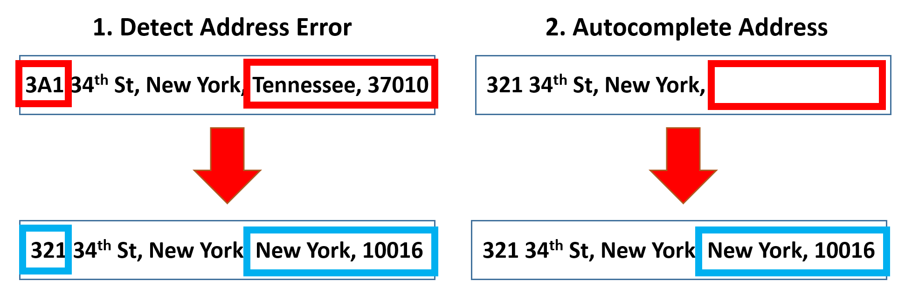

# Address-Auto-Complete
Imagine the chaos of online shopping if addresses were a crapshoot. Wrong deliveries, frustrated customers, and the fraud that could totally ruin our holidays. Address is one of the most important data to get right for all transactions in life. My wife and I buy countless items across dozens of websites, and it's hard to imagine what would happen if the address was incorrect. Luckily this is not a hard problem: we have powerful tools like [Google Maps API](https://developers.google.com/maps/documentation/javascript) to ensure address accuracy. But, are geospatial databases the only way to go?

Recently, I completed the [Deep Learning Specialization](https://coursera.org/share/91ebf1ef9abec8ef3cb7f8f33509206e) course from Andrew NG. During the course of Large Language Models (LLM), I dove into the heart of all advanced sequenced models - attention mechanism. The attention mechanism is a powerful algorithm that has revolutionized the field of Natural Language Processing (NLP). It allows models to focus on specific parts of their input data, which is essential for learning long-range dependencies and understanding the context of complex sequences. Attention mechanisms have been shown to significantly improve the performance of Large Language Models (LLMs) on a variety of tasks, including machine translation, text summarization, and question answering.

My question: **Can a toy-size LLM demonstrate good performance on the task of predicting accurate and auto-complete addresses without any geospatial knowledge?** While it is known that LLMs are capable of learning complex and non-linear relationships between features and predictions on tabular & text data, it is unclear whether they can perform well on address correction (i.e., text generation) without knowing the representative meaning of individual address components such as street names, cities, and states. Can they correctly predict that an address should be in New York, without knowing what the text "New York" mean?

This toy project aims to develop an address autocomplete bot that uses the attention mechanism to autocomplete addresses without requiring any geospatial knowledge. The bot will be trained on a large dataset of correctly formatted addresses, and will use the attention mechanism to learn the relationships between different address components. 

The final address autocomplete bot will be able to do two things:
  1. **Detect Address Error**: When given an inaccurate address, the bot will be able to detect the errors and modify the output address
  2. **Autocomplet Address**: When given an inomplete address, the bot will be able to autocomplete the remaining address.

<p align="center">
     <br>
</p>

# Demonstration
We asked the Address Auto Complete bot to perform the function of both *Detect Address Error* and *Auto Complete Address*. 

Let's use the address `49 Clinton St New York NY 10002` as an example for our demonstration. Why this address? Because I liked this LES restaurant [Yopparai](https://maps.app.goo.gl/NqEAyHaA3Ay3qE2q9) - I just went there for dinner last weekend with friends. 100% recommended!

```python
#Auto Complete Address task 1: Keep street name and City name, and check if the bot can complete the rest
context_raw = '49 Clinton St New York'
result = model.Addressor_fix([context_raw]) 
print(result.numpy()[0].decode())

    49 clinton st new york new york ny 10002 
```

```python
#Auto Complete Address task 2: Keep street name and Zip code, and check if the bot can complete the rest
context_raw = '49 Clinton St 10002'
result = model.Addressor_fix([context_raw]) 
print(result.numpy()[0].decode())

    49 clinton st new york new york ny 10002 
```

```python
#Detect Address Error task 1: What happens if we mistype Los Angeles instead of New York
context_raw = '49 clinton st los angeles new york ny 10002 '
result = model.Addressor_fix([context_raw]) 
print(result.numpy()[0].decode())

print('\n Success!')

    49 clinton st new york new york ny 10002 
```

# File
Please visit the `Address-Auto-Complete.ipynb` notebook for the details.

# *References*
  - [Effective Approaches to Attention-based Neural Machine Translation (Luong et al., 2015)](https://arxiv.org/abs/1508.04025v5)
  - [Neural Machine Translation with attention](https://www.tensorflow.org/text/tutorials/nmt_with_attention)